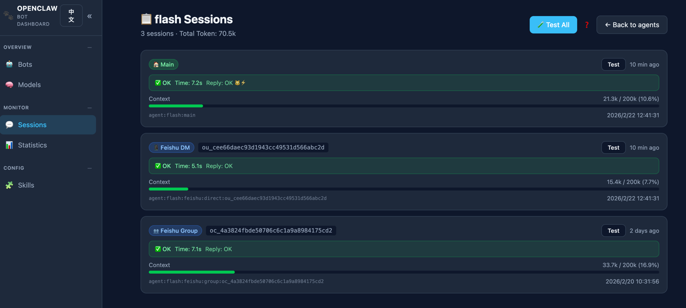

# OpenClaw Bot Dashboard

一個輕量級 Web 儀表板，用於一覽所有 [OpenClaw](https://github.com/openclaw/openclaw) 機器人/Agent/模型/會話的運行狀態。

機器人儀表板：


像素辦公室：


## 背景

當你在多個平台（飛書、Discord 等）上運行多個 OpenClaw Agent 時，管理和監控會變得越來越複雜——哪個機器人用了哪個模型？平台連通性如何？Gateway 是否正常？Token 消耗了多少？

本儀表板讀取本地 OpenClaw 配置和會話數據，提供統一的 Web 界面來實時監控和測試所有 Agent、模型、平台和會話。無需資料庫——所有數據直接來源於 `~/.openclaw/openclaw.json` 和本地會話文件。此外，內置像素風動畫辦公室，讓你的 Agent 化身像素角色在辦公室裡行走、就座、互動，為枯燥的運維增添一份趣味。

## 功能

- **機器人總覽** — 卡片牆展示所有 Agent 的名稱、Emoji、模型、平台綁定、會話統計和 Gateway 健康狀態
- **模型列表** — 查看所有已配置的 Provider 和模型，包含上下文窗口、最大輸出、推理支持及單模型測試
- **會話管理** — 按 Agent 瀏覽所有會話，支持類型識別（私聊、群聊、定時任務）、Token 用量和連通性測試
- **訊息統計** — Token 消耗和平均響應時間趨勢，支持按天/週/月查看，SVG 圖表展示
- **技能管理** — 查看所有已安裝技能（內置、擴展、自定義），支持搜索和篩選
- **告警中心** — 配置告警規則（模型不可用、機器人無響應），通過飛書發送通知
- **Gateway 健康檢測** — 實時 Gateway 狀態指示器，10 秒自動輪詢，點擊可跳轉 OpenClaw Web 頁面
- **平台連通測試** — 一鍵測試所有飛書/Discord 綁定和 DM Session 的連通性
- **自動刷新** — 可配置刷新間隔（手動、10秒、30秒、1分鐘、5分鐘、10分鐘）
- **國際化** — 支持中英文界面切換
- **主題切換** — 側邊欄支持深色/淺色主題切換
- **像素辦公室** — 像素風動畫辦公室，Agent 以像素角色呈現，實時行走、就座、與家具互動（靈感來自 Pixel Agents）
- **實時配置** — 直接讀取 `~/.openclaw/openclaw.json` 和本地會話文件，無需資料庫

## 預覽





## 快速開始

更多啟動方式請見：[快速啟動文檔](quick_start.md)。

```bash
# 克隆倉庫
git clone https://github.com/allen-0777/openclaw-company-sim.git
cd openclaw-company-sim

# 安裝依賴
npm install

# 啟動開發服務器
npm run dev
```

瀏覽器打開 [http://localhost:3000](http://localhost:3000) 即可。

## 技術棧

- Next.js + TypeScript
- Tailwind CSS
- 無資料庫 — 直接讀取配置文件

## 環境要求

- Node.js 18+
- 已安裝 OpenClaw，配置文件位於 `~/.openclaw/openclaw.json`

## 自定義配置路徑

默認讀取 `~/.openclaw/openclaw.json`，可通過環境變量指定自定義路徑：

```bash
OPENCLAW_HOME=/opt/openclaw 
npm run dev
```

## Docker 部署

你也可以使用 Docker 部署儀表板：

### 構建 Docker 鏡像

```bash
docker build -t openclaw-dashboard .
```

### 運行容器

```bash
# 基本運行
docker run -d -p 3000:3000 openclaw-dashboard

# 使用自定義 OpenClaw 配置路徑
docker run -d --name openclaw-dashboard -p 3000:3000 -e OPENCLAW_HOME=/opt/openclaw -v /path/to/openclaw:/opt/openclaw openclaw-dashboard
```

## 作者聯繫方式（contact）
小紅書：[主頁](https://xhslink.com/m/AsJKWgEBt1I) 
<br/>微信：xmanr123
